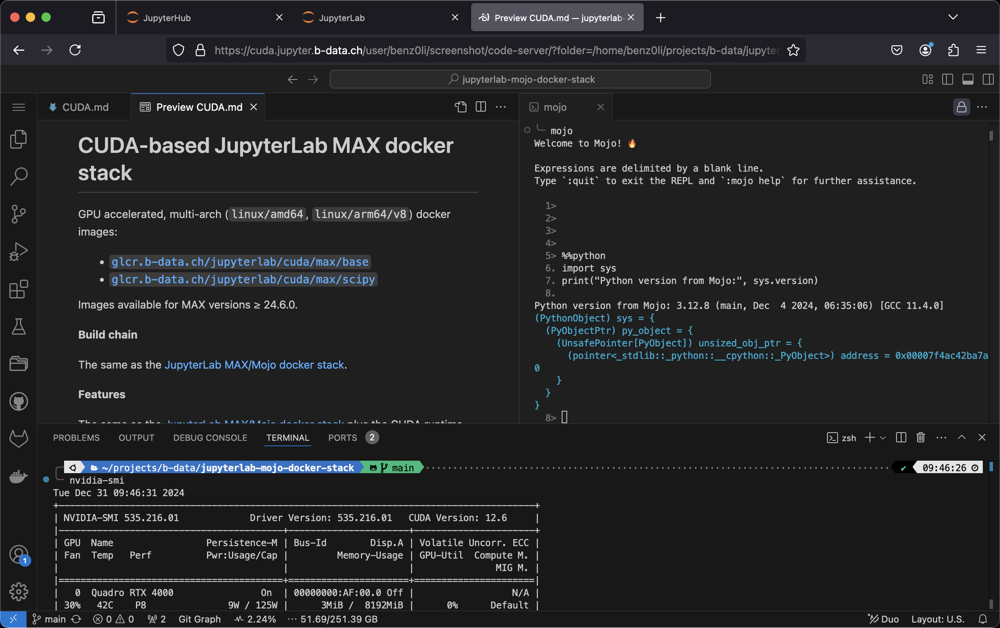

# CUDA-based JupyterLab MAX docker stack

GPU accelerated, multi-arch (`linux/amd64`, `linux/arm64/v8`) docker images:

* [`glcr.b-data.ch/jupyterlab/cuda/max/base`](https://gitlab.b-data.ch/jupyterlab/cuda/max/base/container_registry)
* [`glcr.b-data.ch/jupyterlab/cuda/max/scipy`](https://gitlab.b-data.ch/jupyterlab/cuda/max/scipy/container_registry)

Images available for MAX versions ≥ 24.6.0.



**Build chain**

The same as the
[JupyterLab MAX/Mojo docker stack](README.md#jupyterlab-maxmojo-docker-stack).

**Features**

The same as the
[JupyterLab MAX/Mojo docker stack](README.md#jupyterlab-maxmojo-docker-stack)
plus the CUDA runtime.

:point_right: See the [CUDA Version Matrix](CUDA_VERSION_MATRIX.md) for detailed
information.

**Subtags**

The same as the
[JupyterLab MAX/Mojo docker stack](README.md#jupyterlab-maxmojo-docker-stack).

## Table of Contents

* [Prerequisites](#prerequisites)
* [Install](#install)
* [Usage](#usage)
* [Similar project](#similar-project)

## Prerequisites

The same as the
[JupyterLab MAX/Mojo docker stack](README.md#prerequisites) plus

* NVIDIA GPU
* NVIDIA Linux driver
* NVIDIA Container Toolkit

:information_source: The host running the GPU accelerated images only requires
the NVIDIA driver, the CUDA toolkit does not have to be installed.

## Install

To install the NVIDIA Container Toolkit, follow the instructions for your
platform:

* [Installation Guide &mdash; NVIDIA Cloud Native Technologies documentation](https://docs.nvidia.com/datacenter/cloud-native/container-toolkit/install-guide.html#supported-platforms)

## Usage

### Build image (base)

*latest*:

```shell
cd base
docker build \
  --build-arg BASE_IMAGE=ubuntu \
  --build-arg BASE_IMAGE_TAG=22.04 \
  --build-arg BUILD_ON_IMAGE=glcr.b-data.ch/cuda/python/ver \
  --build-arg MOJO_VERSION=24.6.0 \
  --build-arg PYTHON_VERSION=3.12.8 \
  --build-arg CUDA_IMAGE_FLAVOR=base \
  --build-arg INSTALL_MAX=1 \
  -t jupyterlab/cuda/max/base \
  -f latest.Dockerfile .
```

*version*:

```shell
cd base
docker build \
  --build-arg BASE_IMAGE=ubuntu \
  --build-arg BASE_IMAGE_TAG=22.04 \
  --build-arg BUILD_ON_IMAGE=glcr.b-data.ch/cuda/python/ver \
  --build-arg CUDA_IMAGE_FLAVOR=base \
  --build-arg INSTALL_MAX=1 \
  -t jupyterlab/cuda/max/base:MAJOR.MINOR.PATCH \
  -f MAJOR.MINOR.PATCH.Dockerfile .
```

For `MAJOR.MINOR.PATCH` ≥ `24.6.0`.

### Create home directory

Create an empty directory using docker:

```shell
docker run --rm \
  -v "${PWD}/jupyterlab-jovyan":/dummy \
  alpine chown 1000:100 /dummy
```

It will be *bind mounted* as the JupyterLab user's home directory and
automatically populated.

### Run container

self built:

```shell
docker run -it --rm \
  --gpus '"device=all"' \
  -p 8888:8888 \
  -u root \
  -v "${PWD}/jupyterlab-jovyan":/home/jovyan \
  -e NB_UID=$(id -u) \
  -e NB_GID=$(id -g) \
  jupyterlab/cuda/max/base[:MAJOR.MINOR.PATCH]
```

from the project's GitLab Container Registries:

```shell
docker run -it --rm \
  --gpus '"device=all"' \
  -p 8888:8888 \
  -u root \
  -v "${PWD}/jupyterlab-jovyan":/home/jovyan \
  -e NB_UID=$(id -u) \
  -e NB_GID=$(id -g) \
  IMAGE[:MAJOR[.MINOR[.PATCH]]]
```

`IMAGE` being one of

* [`glcr.b-data.ch/jupyterlab/cuda/max/base`](https://gitlab.b-data.ch/jupyterlab/cuda/max/base/container_registry)
* [`glcr.b-data.ch/jupyterlab/cuda/max/scipy`](https://gitlab.b-data.ch/jupyterlab/cuda/max/scipy/container_registry)

The use of the `-v` flag in the command mounts the empty directory on the host
(`${PWD}/jupyterlab-jovyan` in the command) as `/home/jovyan` in the container.

`-e NB_UID=$(id -u) -e NB_GID=$(id -g)` instructs the startup script to switch
the user ID and the primary group ID of `${NB_USER}` to the user and group ID of
the one executing the command.

The server logs appear in the terminal.

#### Using Podman (rootless mode)

Create an empty home directory:

```shell
mkdir "${PWD}/jupyterlab-root"
```

Use the following command to run the container as `root`:

```shell
podman run -it --rm \
  --device 'nvidia.com/gpu=all' \
  -p 8888:8888 \
  -u root \
  -v "${PWD}/jupyterlab-root":/home/root \
  -e NB_USER=root \
  -e NB_UID=0 \
  -e NB_GID=0 \
  -e NOTEBOOK_ARGS="--allow-root" \
  IMAGE[:MAJOR[.MINOR[.PATCH]]]
```

#### Using Docker Desktop

[Creating a home directory](#create-home-directory) *might* not be required.
Also

```shell
docker run -it --rm \
  --gpus '"device=all"' \
  -p 8888:8888 \
  -v "${PWD}/jupyterlab-jovyan":/home/jovyan \
  IMAGE[:MAJOR[.MINOR[.PATCH]]]
```

*might* be sufficient.

## Similar project

* [MAX container](https://docs.modular.com/max/container/)

**What makes this project different:**

1. Derived from [`nvidia/cuda:12.8.0-base-ubuntu22.04`](https://hub.docker.com/r/nvidia/cuda/tags?page=1&name=12.8.0-base-ubuntu22.04)
1. IDE: [code-server](https://github.com/coder/code-server) next to
   [JupyterLab](https://github.com/jupyterlab/jupyterlab)
1. Just Python – no [Conda](https://github.com/conda/conda) /
   [Mamba](https://github.com/mamba-org/mamba)

The CUDA-based JupyterLab MAX docker stack is derived from the CUDA-based Python
docker stack.  
:information_source: See also [Python docker stack > Notes on CUDA](https://github.com/b-data/python-docker-stack/blob/main/CUDA_NOTES.md).
