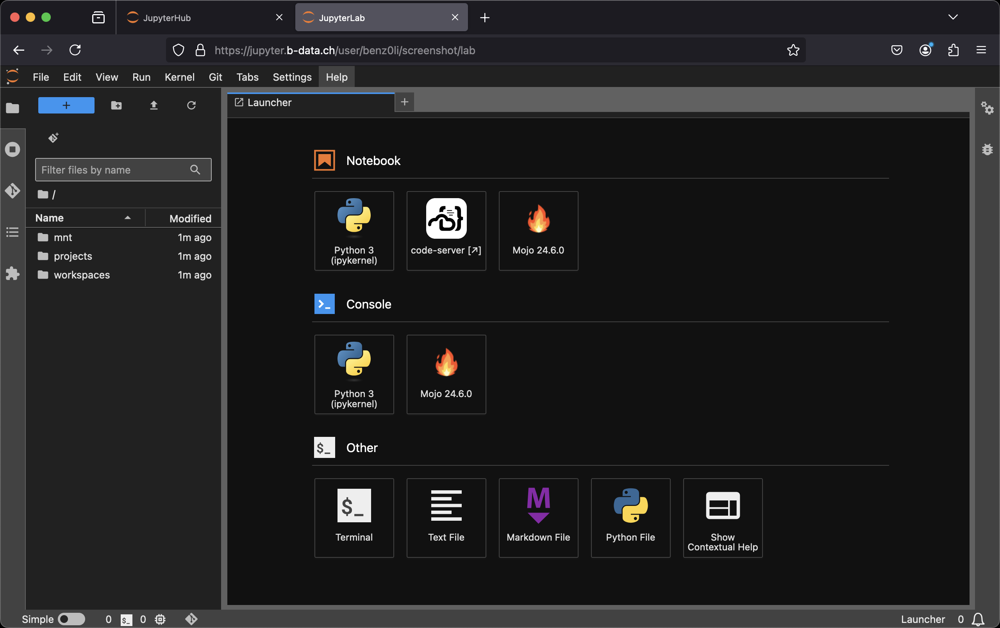

# JupyterLab Mojo docker stack

<!-- markdownlint-disable line-length -->
[](https://github.com/RichardLitt/standard-readme/blob/master/example-readmes/minimal-readme.md) [](https://www.repostatus.org/#active) <a href="https://liberapay.com/benz0li/donate"></a>
<!-- markdownlint-enable line-length -->

Multi-arch (`linux/amd64`, `linux/arm64/v8`) docker images:

* [`glcr.b-data.ch/jupyterlab/mojo/base`](https://gitlab.b-data.ch/jupyterlab/mojo/base/container_registry)
* [`glcr.b-data.ch/jupyterlab/mojo/scipy`](https://gitlab.b-data.ch/jupyterlab/mojo/scipy/container_registry)

Images considered stable for Mojo versions ≥ 24.3.0.

:microscope: Check out `jupyterlab/mojo/scipy` at
<https://demo.jupyter.b-data.ch>.



**Build chain**

base → scipy

**Features**

* **JupyterLab**: A web-based interactive development environment for Jupyter
   notebooks, code, and data. The images include
  * **code-server**: [`Code - OSS`](https://github.com/microsoft/vscode) in the
    browser.
  * **Git**: A distributed version-control system for tracking changes in source
    code.
  * **Git LFS**: A Git extension for versioning large files.
  * **Mojo**: A programming language for AI developers.
  * **Pandoc**: A universal markup converter.
  * **Python**: An interpreted, object-oriented, high-level programming language
    with dynamic semantics.
  * **Quarto**: A scientific and technical publishing system built on Pandoc.  
    :information_source: scipy image
  * **TinyTeX**: A lightweight, cross-platform, portable, and easy-to-maintain
    LaTeX distribution based on TeX Live.  
    :information_source: scipy image
  * **Zsh**: A shell designed for interactive use, although it is also a
    powerful scripting language.

:point_right: See the [Version Matrix](VERSION_MATRIX.md) for detailed
information.

The following extensions are pre-installed for **code-server**:

* [.gitignore Generator](https://github.com/piotrpalarz/vscode-gitignore-generator)
* [Black Formatter](https://open-vsx.org/extension/ms-python/black-formatter)  
  :information_source: devtools subtags
* [Docker](https://open-vsx.org/extension/ms-azuretools/vscode-docker)  
  :information_source: docker subtags
* [EditorConfig](https://open-vsx.org/extension/EditorConfig/EditorConfig)
* [ESLint](https://open-vsx.org/extension/dbaeumer/vscode-eslint)  
  :information_source: devtools subtags
* [Git Graph](https://open-vsx.org/extension/mhutchie/git-graph)
* [GitHub Pull Requests and Issues](https://open-vsx.org/extension/GitHub/vscode-pull-request-github)
* [GitLab Workflow](https://open-vsx.org/extension/GitLab/gitlab-workflow)
* [GitLens — Git supercharged](https://open-vsx.org/extension/eamodio/gitlens)  
  :information_source: Pinned to version 11.7.0 due to unsolicited AI content
* [Excel Viewer](https://open-vsx.org/extension/GrapeCity/gc-excelviewer)
* [hadolint](https://open-vsx.org/extension/exiasr/hadolint)  
  :information_source: docker subtags
* [Jupyter](https://open-vsx.org/extension/ms-toolsai/jupyter)
* [LaTeX Workshop](https://open-vsx.org/extension/James-Yu/latex-workshop)  
  :information_source: scipy image
* [markdownlint](https://open-vsx.org/extension/DavidAnson/vscode-markdownlint)
* Mojo
* [Path Intellisense](https://open-vsx.org/extension/christian-kohler/path-intellisense)
* [Prettier - Code formatter](https://open-vsx.org/extension/esbenp/prettier-vscode)  
  :information_source: devtools subtags
* [Project Manager](https://open-vsx.org/extension/alefragnani/project-manager)
* [Python](https://open-vsx.org/extension/ms-python/python)
* [Quarto](https://open-vsx.org/extension/quarto/quarto)  
  :information_source: scipy image
* Resource Monitor
* [ShellCheck](https://open-vsx.org/extension/timonwong/shellcheck)  
  :information_source: devtools and docker subtags
* [YAML](https://open-vsx.org/extension/redhat/vscode-yaml)

**Subtags**

* `{MOJO_VERSION,latest}-root`: Container runs as `root`
* `{MOJO_VERSION,latest}-devtools`: Includes the
  requirements according to
  * [coder/code-server > Docs > Contributing](https://github.com/coder/code-server/blob/main/docs/CONTRIBUTING.md)
  * [microsoft/vscode-python > Wiki > Coding](https://github.com/microsoft/vscode-python/wiki/Coding)
* `{MOJO_VERSION,latest}-devtools-root`: The combination of both
* `{MOJO_VERSION,latest}-docker`: Includes
  * `docker-ce-cli`
  * `docker-buildx-plugin`
  * `docker-compose-plugin`
  * `docker-scan-plugin` (amd64 only)
* `{MOJO_VERSION,latest}-docker-root`: The combination of both
* `{MOJO_VERSION,latest}-devtools-docker`: The combination of both
* `{MOJO_VERSION,latest}-devtools-docker-root`: The combination of all three

:information_source: See also [Notes on subtag `devtools`](DEVTOOLS_NOTES.md).

## Table of Contents

* [Prerequisites](#prerequisites)
* [Install](#install)
* [Usage](#usage)
* [Similar projects](#similar-projects)
* [Contributing](#contributing)
* [Support](#support)
* [License](#license)

## Prerequisites

This projects requires an installation of docker.

## Install

To install docker, follow the instructions for your platform:

* [Install Docker Engine | Docker Documentation > Supported platforms](https://docs.docker.com/engine/install/#supported-platforms)
* [Post-installation steps for Linux](https://docs.docker.com/engine/install/linux-postinstall/)

## Usage

### Build image (base)

latest:

```bash
cd base && docker build \
  --build-arg MODULAR_VERSION=0.8.0 \
  --build-arg MODULAR_AUTH_KEY=<your-modular-auth-key> \
  --build-arg MOJO_VERSION=24.3.0 \
  --build-arg PYTHON_VERSION=3.12.4 \
  -t jupyterlab/mojo/base \
  -f latest.Dockerfile .
```

version:

```bash
cd base && docker build \
  --build-arg MODULAR_AUTH_KEY=<your-modular-auth-key> \
  -t jupyterlab/mojo/base:MAJOR.MINOR.PATCH \
  -f MAJOR.MINOR.PATCH.Dockerfile .
```

For `MAJOR.MINOR.PATCH` ≥ `24.3.0`.

### Create home directory

Create an empty directory using docker:

```bash
docker run --rm \
  -v "${PWD}/jupyterlab-jovyan":/dummy \
  alpine chown 1000:100 /dummy
```

It will be *bind mounted* as the JupyterLab user's home directory and
automatically populated.

### Run container

self built:

```bash
docker run -it --rm \
  -p 8888:8888 \
  -u root \
  -v "${PWD}/jupyterlab-jovyan":/home/jovyan \
  -e NB_UID=$(id -u) \
  -e NB_GID=$(id -g) \
  jupyterlab/mojo/base[:MAJOR.MINOR.PATCH]
```

from the project's GitLab Container Registries:

```bash
docker run -it --rm \
  -p 8888:8888 \
  -u root \
  -v "${PWD}/jupyterlab-jovyan":/home/jovyan \
  -e NB_UID=$(id -u) \
  -e NB_GID=$(id -g) \
  IMAGE[:MAJOR[.MINOR[.PATCH]]]
```

`IMAGE` being one of

* [`glcr.b-data.ch/jupyterlab/mojo/base`](https://gitlab.b-data.ch/jupyterlab/mojo/base/container_registry)
* [`glcr.b-data.ch/jupyterlab/mojo/scipy`](https://gitlab.b-data.ch/jupyterlab/mojo/scipy/container_registry)

The use of the `-v` flag in the command mounts the empty directory on the host
(`${PWD}/jupyterlab-jovyan` in the command) as `/home/jovyan` in the container.

`-e NB_UID=$(id -u) -e NB_GID=$(id -g)` instructs the startup script to switch
the user ID and the primary group ID of `${NB_USER}` to the user and group ID of
the one executing the command.

The server logs appear in the terminal.

#### Using Podman (rootless mode)

Create an empty home directory:

```bash
mkdir "${PWD}/jupyterlab-root"
```

Use the following command to run the container as `root`:

```bash
podman run -it --rm \
  -p 8888:8888 \
  -u root \
  -v "${PWD}/jupyterlab-root":/home/root \
  -e NB_USER=root \
  -e NB_UID=0 \
  -e NB_GID=0 \
  -e NOTEBOOK_ARGS="--allow-root" \
  IMAGE[:MAJOR[.MINOR[.PATCH]]]
```

#### Using Docker Desktop

[Creating a home directory](#create-home-directory) *might* not be required.
Also

```bash
docker run -it --rm \
  -p 8888:8888 \
  -v "${PWD}/jupyterlab-jovyan":/home/jovyan \
  IMAGE[:MAJOR[.MINOR[.PATCH]]]
```

*might* be sufficient.

## Similar projects

* [modularml/mojo](https://github.com/modularml/mojo/tree/main/examples)

What makes this project different:

1. Multi-arch: `linux/amd64`, `linux/arm64/v8`  
   :information_source: Runs on Apple M series using Docker Desktop.
1. Base image: [Debian](https://hub.docker.com/_/debian) instead of
   [Ubuntu](https://hub.docker.com/_/ubuntu)  
   :information_source: Upcoming: CUDA-enabled images are Ubuntu-based.
1. IDE: [code-server](https://github.com/coder/code-server) next to
   [JupyterLab](https://github.com/jupyterlab/jupyterlab)  
   :information_source: code-server =
   [`Code - OSS`](https://github.com/microsoft/vscode) in the browser.
1. Just Python – no [Conda](https://github.com/conda/conda) /
   [Mamba](https://github.com/mamba-org/mamba)

See [Notes](NOTES.md) for tweaks, settings, etc.

## Contributing

PRs accepted. Please submit to the
[GitLab repository](https://gitlab.com/b-data/jupyterlab/mojo/docker-stack).

This project follows the
[Contributor Covenant](https://www.contributor-covenant.org)
[Code of Conduct](CODE_OF_CONDUCT.md).

## Support

For commercial support, please contact b-data by email: <support@b-data.ch>.

b-data tailors the JupyterLab images to your needs, e.g.

* Integration of self-signed CA certificates to enable communication with web
  services on the intranet.
* Setting up the necessary environment variables so that everything works
  behind a corporate proxy server.

Additionally, the
[JupyterHub](https://github.com/b-data/docker-deployment-jupyter) setup can be
customised to allow

* authentication with AD/LDAP
* mounting CIFS/SMB file shares

and much more.

## License

Copyright © 2024 b-data GmbH

Distributed under the terms of the [MIT License](LICENSE), with exceptions.
